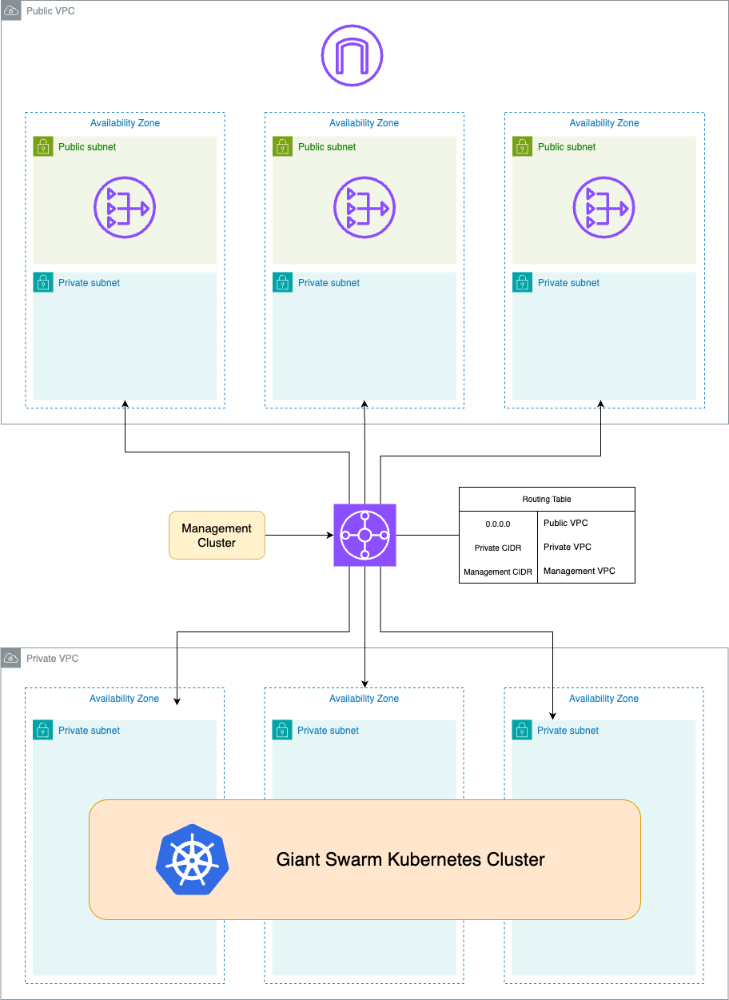
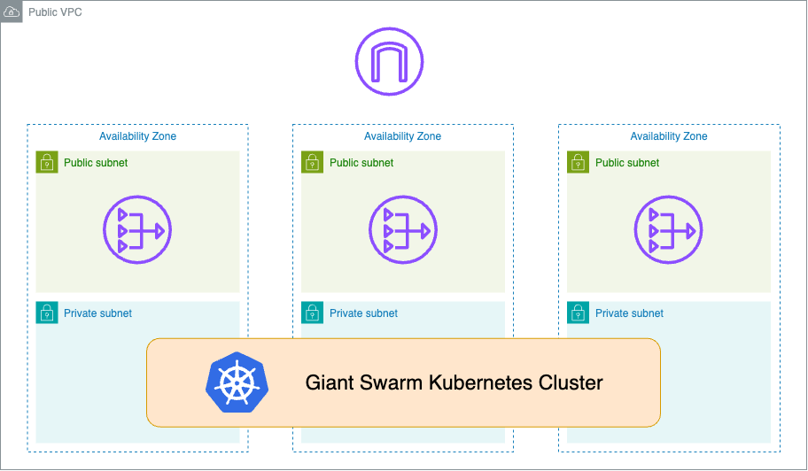

# CAPA Bring-Your-Own-VPC Examples

This repository contains examples and information on how to Bring Your Own VPC with the Giant Swarm platform.

## Cluster with private subnets only
A private cluster is a type of cluster that is deployed within private subnets of an existing VPC. This means that the cluster's worker nodes and control plane components are not directly accessible from the internet. The private cluster provides an additional layer of security by isolating the cluster resources from external access.

Access to the cluster is achieved through the use of a Transit Gateway. It's not possible to attach public load balancers directly.

Internet egress access is achieved routing all the traffic via a Transit Gateway to another VPC with public subnets, Internet Gateway and NAT Gateways.

Check the terraform code in [private-vpc](vpc-examples/private-vpc/) to create this scenario and the [cluster definition](vpc-examples/private-vpc/example-cluster.yaml).

Once the infrastructure is created, you will need to attache the Transit Gateway to the Management Cluster VPC and add routing to the MC private subnets to the WC private subnets through the Transit Gateway.

## Cluster with public subnets
A cluster with public subnets allows for the creation of public ingress and provides an internet-reachable Kubernetes API. This type of cluster is suitable for scenarios where external access to the cluster resources is required. Public load balancers can be attached directly to the worker nodes and control plane components, enabling easy access from the internet.

Check the terraform code in [public-vpc](vpc-examples/public-vpc/) to create this scenario and the [cluster definition](vpc-examples/public-vpc/example-cluster.yaml).

## VPC requirements

The requirements to adopt an existing VPC into a CAPA cluster are:

- Existing VPC
- Existing Subnets
  - All subnets to be used by the cluster need to be tagged:
    - `kubernetes.io/cluster/<cluster_name>: shared`
  - All public subnets (if any) need to be tagged:
    - `kubernetes.io/role/elb: "1"`
  - All private subnets need to be tagged:
    - `kubernetes.io/role/internal-elb: "1"`
    - `sigs.k8s.io/cluster-api-provider-aws/role: private`
- Existing route tables
  - All route tables to be used by the cluster need to be tagged:
    - `kubernetes.io/cluster/<cluster_name>: shared`
- Working routing between the subnets and to the internet / proxy, including any needed NAT and Internet Gateways
- It's recommended that the subnet configuration encompasses two or more AZs, for increased resilience

To create a cluster adopting existing VPC and subnets, you need to set their IDs under `global.connectivity` in the Cluster App values, as shown in the [provided example manifests](./example-cluster.yaml).
